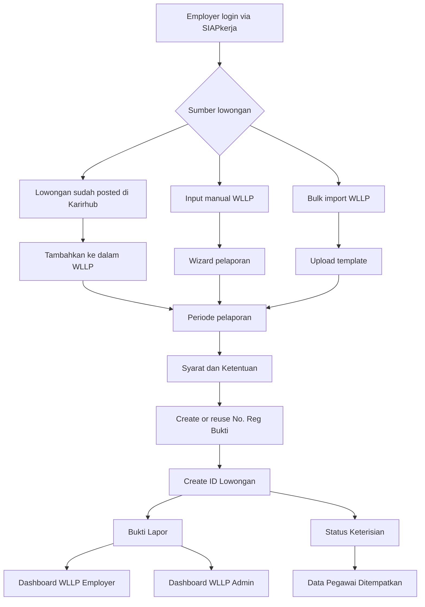

# Business Requirements Document (BRD)
# Karirhub Employer Prototype - Wajib Lapor Lowongan Pekerjaan (WLLP)

Version: 1.0  
Prepared for: Implementation planning and production engineering  
Source reference: Current `Karirhub Employer Prototype` module in PasAdmin  
Document date: 2026-05-26

---

## 1. Executive Summary

Karirhub Employer Prototype adalah prototype alur Wajib Lapor Lowongan Pekerjaan (WLLP) untuk pemberi kerja dan admin. Prototype ini mensimulasikan:

- Pelaporan lowongan kerja secara manual dan massal.
- Integrasi lowongan yang sudah diposting di Karirhub ke dalam WLLP.
- Penerbitan No. Reg Bukti dan Bukti Lapor.
- Monitoring status keterisian lowongan dan data pegawai ditempatkan.
- Dashboard employer dan dashboard admin lintas employer.
- Monitoring kepatuhan pelaporan WLLP.

Dokumen BRD ini mengubah prototype menjadi kebutuhan bisnis dan teknis tingkat produksi yang dapat digunakan sebagai dasar coding, desain API, desain database, pengujian, dan integrasi dengan sistem production seperti Karirhub, SIAPkerja, WLKP/WLLP, dan layanan otorisasi Kemnaker.

---

## 2. Business Objectives

### 2.1 Tujuan Utama

1. Menyediakan mekanisme resmi bagi pemberi kerja untuk melaporkan lowongan pekerjaan ke Kementerian Ketenagakerjaan.
2. Memastikan data lowongan pekerjaan yang tersedia di Karirhub dapat masuk ke alur WLLP secara terstruktur.
3. Memungkinkan satu No. Reg Bukti merepresentasikan banyak ID Lowongan dalam periode pelaporan yang sama.
4. Memudahkan employer memonitor status keterisian lowongan dan menyampaikan data penempatan tenaga kerja.
5. Memberikan dashboard analitik bagi admin Kemnaker untuk memantau kepatuhan, tren pelaporan, distribusi wilayah, dan status keterisian lintas employer.
6. Menghasilkan Bukti Lapor yang dapat diverifikasi dan dapat digunakan sebagai dokumen administratif.

### 2.2 Business Outcomes

- Peningkatan kepatuhan pemberi kerja dalam pelaporan lowongan.
- Pengurangan lowongan fiktif, tidak valid, dan menyesatkan melalui validasi dan audit trail.
- Tersedianya data kebutuhan tenaga kerja yang lebih mutakhir dan terstruktur.
- Kemudahan pelacakan hubungan antara lowongan Karirhub, laporan WLLP, status keterisian, dan penempatan.
- Tersedianya data analitik untuk kebijakan ketenagakerjaan.

---

## 3. Scope

### 3.1 In Scope

1. Modul Employer WLLP:
   - Pelaporan lowongan manual.
   - Pelaporan lowongan massal via template.
   - Syarat dan Ketentuan persetujuan pelaporan.
   - Bukti Lapor dan PDF resmi.
   - No. Reg Bukti.
   - Status Keterisian.
   - Data Pegawai yang Ditempatkan.
   - Job Posted Karirhub to WLLP.

2. Modul Admin WLLP:
   - Dashboard WLLP Admin.
   - Analitik lintas employer.
   - Filter periode, employer, unit, status, wilayah.
   - Drill-down ke Bukti Lapor, Status Keterisian, dan No. Reg Bukti.

3. Data dan Integrasi:
   - Integrasi data employer/unit dari SIAPkerja/Karirhub.
   - Integrasi data job posting dari Karirhub.
   - Integrasi status dan bukti lapor WLLP.
   - Audit trail dan consent logging.

### 3.2 Out of Scope for V1 Production

1. Pembayaran, transaksi finansial, atau monetisasi lowongan.
2. Sistem rekrutmen penuh seperti shortlisting otomatis, scoring kandidat, dan ATS lengkap.
3. Validasi Dukcapil real-time untuk data pegawai, kecuali disiapkan sebagai integrasi lanjutan.
4. AI matching kandidat.
5. Pengelolaan iklan lowongan berbayar.

---

## 4. Current Prototype Summary

Prototype saat ini berbasis PHP dan MySQL lokal dengan prefix file:

- `karirhub_employer_prototype_*.php`
- `karirhub_employer_prototype_storage.php`
- `karirhub_employer_prototype_data.php`
- `karirhub_employer_prototype_ui.php`

Prototype menggunakan 4 tabel utama:

1. `karirhub_proto_wllp_laporan`
2. `karirhub_proto_wllp_pelaporan`
3. `karirhub_proto_wllp_status`
4. `karirhub_proto_wllp_penempatan`

Prototype sudah mendukung:

- Satu No. Reg Bukti untuk banyak ID Lowongan.
- Periode pelaporan weekly/monthly.
- Job Posted Karirhub dapat ditambahkan ke WLLP.
- Jika anchor baru berada dalam rentang periode yang sama, No. Reg Bukti yang sama digunakan kembali.
- Label `Berhasil ditambahkan ke WLLP` untuk job yang sudah masuk WLLP.
- Modal Syarat dan Ketentuan saat submit pelaporan form.

---

## 5. Stakeholders and Actors

| Actor | Description | Main Goals |
|---|---|---|
| Employer Admin / HR | User perusahaan yang mengelola posting lowongan dan WLLP | Melapor lowongan, mengelola bukti lapor, update keterisian |
| Employer PIC / Account Manager | Pengelola akun perusahaan di SIAPkerja/Karirhub | Menjaga data perusahaan dan pelaporan tetap valid |
| Kemnaker Admin | Admin pusat yang memonitor data lintas employer | Analitik, validasi, monitoring kepatuhan |
| Verifikator Kemnaker | Petugas validasi data lowongan/WLLP | Memvalidasi, meminta perbaikan, menolak laporan |
| System Integrator/API Consumer | Service internal Karirhub/SIAPkerja/WLLP | Integrasi data dan sinkronisasi status |
| Auditor/Compliance Officer | Pemeriksa kepatuhan dan audit data | Melihat log, bukti persetujuan, histori perubahan |

---

## 6. Production Business Process Overview

---

## 7. Functional Requirements

### 7.1 Authentication and Authorization

| ID | Requirement | Priority |
|---|---|---|
| AUTH-001 | System shall require authenticated SIAPkerja/Karirhub account before accessing WLLP employer features. | Must |
| AUTH-002 | System shall distinguish employer user, employer admin, Kemnaker admin, verifikator, and auditor roles. | Must |
| AUTH-003 | Employer users shall only access data for their own employer and authorized units. | Must |
| AUTH-004 | Kemnaker admin shall access cross-employer dashboard based on jurisdiction and role. | Must |
| AUTH-005 | System shall record user ID, role, employer ID, IP address, and timestamp for all create/update actions. | Must |

### 7.2 Employer and Unit Data

| ID | Requirement | Priority |
|---|---|---|
| EMP-001 | System shall retrieve employer profile from SIAPkerja/Karirhub master data. | Must |
| EMP-002 | System shall support employer with multiple units/branches. | Must |
| EMP-003 | Employer and unit data shall not be free-text in production. | Must |
| EMP-004 | System shall validate that the selected unit belongs to the logged-in employer. | Must |
| EMP-005 | Employer profile changes shall be synced or referenced from authoritative master data. | Should |

### 7.3 Pelaporan Lowongan Manual

| ID | Requirement | Priority |
|---|---|---|
| WLLP-FORM-001 | User shall choose reporting method: bulk import or form input. | Must |
| WLLP-FORM-002 | Form flow shall ask reporting period type: weekly or monthly. | Must |
| WLLP-FORM-003 | Form flow shall ask anchor date and derive period start/end. | Must |
| WLLP-FORM-004 | User shall input number of lowongan to report. | Must |
| WLLP-FORM-005 | System shall render one detail form per lowongan. | Must |
| WLLP-FORM-006 | Each lowongan shall include job title, needed headcount, qualification, location, KBJI, industry, work type, salary range, posting URL, validity date, and description. | Must |
| WLLP-FORM-007 | System shall validate required fields before submit. | Must |
| WLLP-FORM-008 | System shall require Syarat dan Ketentuan consent before final submit. | Must |
| WLLP-FORM-009 | System shall create one No. Reg Bukti and many ID Lowongan for one submission. | Must |
| WLLP-FORM-010 | System shall show success summary with No. Reg Bukti, ID Lowongan list, status, and period. | Must |

### 7.4 Bulk Import Pelaporan

| ID | Requirement | Priority |
|---|---|---|
| BULK-001 | User shall download official Excel template. | Must |
| BULK-002 | Template shall include all fields required by WLLP. | Must |
| BULK-003 | System shall validate uploaded file server-side, not only client-side. | Must |
| BULK-004 | System shall show row-level validation result before final commit. | Must |
| BULK-005 | User shall confirm Syarat dan Ketentuan before bulk data is saved. | Must |
| BULK-006 | Bulk import shall be transactional: all valid rows in a batch are saved or failed rows are isolated with clear error report. | Must |
| BULK-007 | System shall support download of validation error report. | Should |
| BULK-008 | System shall prevent duplicate rows from repeated upload using idempotency key or upload batch ID. | Must |

### 7.5 Syarat dan Ketentuan

| ID | Requirement | Priority |
|---|---|---|
| TERMS-001 | System shall show Syarat dan Ketentuan before final submission. | Must |
| TERMS-002 | User shall check agreement statement before submit. | Must |
| TERMS-003 | System shall store consent timestamp, user ID, employer ID, terms version, IP address, and source channel. | Must |
| TERMS-004 | System shall reject submission if consent is missing. | Must |
| TERMS-005 | Terms content shall be versioned and configurable by authorized admin. | Should |

### 7.6 Job Posted Karirhub to WLLP

| ID | Requirement | Priority |
|---|---|---|
| JOB-001 | System shall list jobs already posted in Karirhub. | Must |
| JOB-002 | User shall open job detail from posted job title. | Must |
| JOB-003 | User shall click `Tambahkan ke dalam WLLP` from job list or job detail. | Must |
| JOB-004 | System shall ask reporting period type and anchor date. | Must |
| JOB-005 | System shall reuse existing No. Reg Bukti if employer, period type, and anchor date fall within existing period range. | Must |
| JOB-006 | System shall create new ID Lowongan under reused No. Reg Bukti. | Must |
| JOB-007 | System shall prevent duplicate WLLP insertion for the same Karirhub job ID. | Must |
| JOB-008 | UI shall display status label `Berhasil ditambahkan ke WLLP` after successful insertion. | Must |
| JOB-009 | Button shall be disabled or changed to `Sudah ditambahkan ke WLLP` after insertion. | Must |
| JOB-010 | Field mapping from Karirhub job data to WLLP detail shall use real job attributes, not fallback defaults. | Must |

### 7.7 No. Reg Bukti

| ID | Requirement | Priority |
|---|---|---|
| REG-001 | System shall generate No. Reg Bukti using agreed format. | Must |
| REG-002 | Format shall be configurable but initial target is `WLLP-57YYMM-XXXXXXXX`. | Must |
| REG-003 | One No. Reg Bukti can represent multiple ID Lowongan. | Must |
| REG-004 | For same employer and same derived reporting period, system should reuse existing No. Reg Bukti where applicable. | Must |
| REG-005 | System shall provide search by No. Reg Bukti, ID Lowongan, job title, employer, unit, and status. | Must |

### 7.8 Bukti Lapor and PDF

| ID | Requirement | Priority |
|---|---|---|
| PROOF-001 | System shall list Bukti Lapor grouped by No. Reg Bukti. | Must |
| PROOF-002 | User shall view detail of all ID Lowongan under one No. Reg Bukti. | Must |
| PROOF-003 | User shall print Bukti Lapor. | Should |
| PROOF-004 | User shall download official PDF. | Must |
| PROOF-005 | PDF shall include Kemnaker header, address, logo, watermark, proof metadata, reported lowongan summary, and verification indicator. | Must |
| PROOF-006 | Production PDF shall include QR code or verification URL. | Must |
| PROOF-007 | Production PDF shall include digital signature or official validation marker if legally required. | Should |

### 7.9 Status Keterisian

| ID | Requirement | Priority |
|---|---|---|
| STATUS-001 | Employer shall view all reported lowongan and current fill status. | Must |
| STATUS-002 | Employer shall update status to Belum Terisi, Proses Seleksi, Terisi, or Belum Update. | Must |
| STATUS-003 | Status update shall be persisted in database. | Must |
| STATUS-004 | Status history shall be recorded. | Must |
| STATUS-005 | When status is Terisi, system shall require data pegawai ditempatkan. | Must |
| STATUS-006 | System shall support multiple placements if jumlah_kebutuhan > 1. | Must |
| STATUS-007 | Bulk import data pegawai ditempatkan shall persist server-side. | Should |

### 7.10 Data Pegawai Yang Ditempatkan

| ID | Requirement | Priority |
|---|---|---|
| PLACE-001 | System shall capture NIK, nama, pendidikan, jenis kelamin, tempat/tanggal lahir, alamat, disabilitas, TMT, email, nomor HP. | Must |
| PLACE-002 | System shall validate NIK length and format. | Must |
| PLACE-003 | System shall validate email and phone format. | Must |
| PLACE-004 | System shall support more than one placed worker per ID Lowongan if jumlah kebutuhan > 1. | Must |
| PLACE-005 | System shall update fill count based on placement rows. | Must |

### 7.11 Dashboard WLLP Employer

| ID | Requirement | Priority |
|---|---|---|
| DASH-E-001 | Employer dashboard shall show total reported lowongan, active lowongan, filled lowongan, and lowongan needing update. | Must |
| DASH-E-002 | Dashboard shall show latest Bukti Lapor. | Must |
| DASH-E-003 | Dashboard shall show compliance by unit. | Must |
| DASH-E-004 | Dashboard shall use DB/source of truth, not static seed data. | Must |
| DASH-E-005 | Dashboard shall provide quick navigation to Pelaporan, Bukti Lapor, Job Posted, and Status Keterisian. | Must |

### 7.12 Dashboard WLLP Admin

| ID | Requirement | Priority |
|---|---|---|
| DASH-A-001 | Admin dashboard shall aggregate data across employers. | Must |
| DASH-A-002 | Admin dashboard shall filter by period, employer, unit, status, and region. | Must |
| DASH-A-003 | Admin dashboard shall show trend, funnel, geo distribution, and employer compliance. | Must |
| DASH-A-004 | Each visualization shall have detail table and drill-down link. | Must |
| DASH-A-005 | Admin dashboard shall enforce admin-specific authorization. | Must |
| DASH-A-006 | Admin dashboard shall support export to CSV/XLSX. | Should |

### 7.13 Monitoring Kepatuhan

| ID | Requirement | Priority |
|---|---|---|
| COMP-001 | System shall compute compliance from actual WLLP DB data. | Must |
| COMP-002 | Compliance rules shall be configurable. | Should |
| COMP-003 | System shall identify employer/unit requiring attention. | Must |
| COMP-004 | System shall support escalation/notification for overdue status updates. | Should |

---

## 8. Business Rules

### 8.1 Period Rules

| Rule ID | Rule |
|---|---|
| BR-PER-001 | Weekly period starts Monday and ends Sunday based on anchor date. |
| BR-PER-002 | Monthly period starts on first day and ends on last day of anchor month. |
| BR-PER-003 | If a WLLP header exists for same employer and period type, and new anchor date is between `periode_mulai` and `periode_selesai`, system shall reuse same No. Reg Bukti. |
| BR-PER-004 | New No. Reg Bukti shall be generated only if no matching header exists. |

### 8.2 No. Reg Bukti Rules

| Rule ID | Rule |
|---|---|
| BR-REG-001 | Format: `WLLP-57YYMM-XXXXXXXX`. |
| BR-REG-002 | `YYMM` is derived from period anchor date. |
| BR-REG-003 | Sequence is 8 digits and unique within prefix. |
| BR-REG-004 | One No. Reg Bukti can contain many ID Lowongan. |

### 8.3 Job Posted Rules

| Rule ID | Rule |
|---|---|
| BR-JOB-001 | A Karirhub posted job can be added to WLLP once. |
| BR-JOB-002 | Deduplication in production must use stable Karirhub job ID, not job title. |
| BR-JOB-003 | After insertion, UI shall show `Berhasil ditambahkan ke WLLP`. |
| BR-JOB-004 | Closed jobs may be allowed or blocked based on policy. Recommendation: allow if employer confirms, but flag as closed source job. |

### 8.4 Terms Rules

| Rule ID | Rule |
|---|---|
| BR-TERM-001 | Every WLLP submission path must require terms consent. |
| BR-TERM-002 | Consent must be stored with terms version. |
| BR-TERM-003 | Submission without consent shall be rejected. |

### 8.5 Status and Placement Rules

| Rule ID | Rule |
|---|---|
| BR-STAT-001 | Default status after report is `Belum Terisi`. |
| BR-STAT-002 | `Terisi` status requires at least one placement record. |
| BR-STAT-003 | Fill count cannot exceed `jumlah_kebutuhan`. |
| BR-STAT-004 | If placement count equals kebutuhan, status can be `Terisi`. |
| BR-STAT-005 | If placement count is greater than 0 but less than kebutuhan, status can be `Terisi Sebagian` if business accepts the state. |

---

## 9. Recommended Production Data Model

### 9.1 Core Tables

#### `employers`

| Column | Notes |
|---|---|
| `id` | Primary key |
| `siapkerja_account_id` | Reference to SIAPkerja |
| `name` | Employer name |
| `nib` | Business identity if applicable |
| `status` | active/suspended |
| `created_at`, `updated_at` | Audit timestamps |

#### `employer_units`

| Column | Notes |
|---|---|
| `id` | Primary key |
| `employer_id` | FK to employers |
| `name` | Unit/branch name |
| `province_id`, `city_id`, `district_id`, `village_id` | Region master refs |
| `address` | Full address |

#### `karirhub_jobs`

| Column | Notes |
|---|---|
| `id` | Karirhub job ID |
| `employer_id` | FK |
| `unit_id` | FK |
| `title` | Job title |
| `status` | active/closed/draft |
| `posted_url` | Public URL |
| `posted_at`, `closed_at` | Dates |
| `raw_payload` | Optional JSON snapshot |

#### `wllp_reports`

| Column | Notes |
|---|---|
| `id` | Primary key |
| `no_reg_bukti` | Unique |
| `employer_id` | FK |
| `unit_id` | FK or nullable if report spans units |
| `period_type` | weekly/monthly |
| `period_anchor` | Date selected by user |
| `period_start`, `period_end` | Derived |
| `verification_status` | draft/submitted/verified/needs_update/rejected |
| `terms_consent_id` | FK |
| `created_by` | User ID |
| `created_at`, `updated_at` | Timestamps |

#### `wllp_report_items`

| Column | Notes |
|---|---|
| `id` | Primary key |
| `report_id` | FK to wllp_reports |
| `id_lowongan` | Unique business ID |
| `karirhub_job_id` | Nullable FK |
| `title` | Job title |
| `headcount_needed` | Jumlah kebutuhan |
| `gender_requirement` | Enum |
| `age_min`, `age_max` | Integers |
| `education_min` | Master/ref or text |
| `job_description` | Text |
| `skills` | Text/JSON |
| `experience_min_years` | Int |
| `salary_range` | Text or numeric min/max |
| `kbji_code` | FK/master |
| `province_id`, `city_id`, `district_id`, `village_id` | Region refs |
| `job_field_id`, `industry_id` | Master refs |
| `marital_status_requirement` | Optional |
| `work_type` | Full Time/Part Time/Contract/Internship |
| `valid_from`, `valid_until` | Dates |
| `posting_url` | URL |
| `verification_status` | Item-level status |

#### `wllp_item_statuses`

| Column | Notes |
|---|---|
| `id` | Primary key |
| `report_item_id` | FK |
| `status` | Belum Terisi/Proses Seleksi/Terisi/Belum Update |
| `filled_count` | Derived or stored |
| `last_updated_by` | User ID |
| `last_updated_at` | Timestamp |

#### `wllp_placements`

| Column | Notes |
|---|---|
| `id` | Primary key |
| `report_item_id` | FK |
| `nik` | Worker identity |
| `full_name` | Worker name |
| `education` | Education |
| `gender` | Gender |
| `birth_place`, `birth_date` | Birth data |
| `address` | Address |
| `disability_status` | Boolean/enum |
| `start_date` | TMT |
| `email`, `phone` | Contact |
| `created_by`, `created_at`, `updated_at` | Audit |

#### `wllp_terms_consents`

| Column | Notes |
|---|---|
| `id` | Primary key |
| `terms_version` | Version string |
| `employer_id` | FK |
| `user_id` | User |
| `source` | manual_form/bulk_import/job_posted |
| `consented_at` | Timestamp |
| `ip_address`, `user_agent` | Audit |

#### `audit_logs`

| Column | Notes |
|---|---|
| `id` | Primary key |
| `actor_user_id` | User |
| `actor_role` | Role |
| `entity_type`, `entity_id` | Target |
| `action` | create/update/delete/verify/export |
| `before_json`, `after_json` | Change snapshot |
| `created_at` | Timestamp |

---

## 10. API Requirements

### 10.1 Employer APIs

| Method | Endpoint | Purpose |
|---|---|---|
| GET | `/api/wllp/employer/dashboard` | Employer dashboard metrics |
| GET | `/api/wllp/reports` | List Bukti Lapor |
| POST | `/api/wllp/reports` | Create WLLP report manually |
| POST | `/api/wllp/reports/bulk/validate` | Validate bulk file |
| POST | `/api/wllp/reports/bulk/commit` | Commit bulk import |
| GET | `/api/wllp/reports/{id}` | Report detail |
| GET | `/api/wllp/reports/{id}/pdf` | Download PDF |
| GET | `/api/karirhub/jobs/posted` | List posted Karirhub jobs |
| POST | `/api/karirhub/jobs/{jobId}/add-to-wllp` | Add Karirhub job to WLLP |
| GET | `/api/wllp/items/{itemId}/status` | Get status |
| PUT | `/api/wllp/items/{itemId}/status` | Update status |
| POST | `/api/wllp/items/{itemId}/placements` | Add placement |

### 10.2 Admin APIs

| Method | Endpoint | Purpose |
|---|---|---|
| GET | `/api/admin/wllp/dashboard` | Admin analytics |
| GET | `/api/admin/wllp/reports` | Cross-employer reports |
| GET | `/api/admin/wllp/compliance` | Compliance monitoring |
| PUT | `/api/admin/wllp/reports/{id}/verification` | Verify/reject/needs update |
| GET | `/api/admin/wllp/export` | Export analytics/report data |

---

## 11. UI/UX Requirements

### 11.1 Global Navigation

- Add menu under Karirhub Employer/Employer Console:
  - Dashboard WLLP
  - Dashboard WLLP Admin (admin role only)
  - Job Posted Karirhub
  - Bukti Lapor
  - Pelaporan Lowongan
  - Status Keterisian
  - Monitoring Kepatuhan

### 11.2 Pelaporan Lowongan Landing

User first sees two primary choices:

1. `Laporkan Lowongan Kerja dalam Jumlah Banyak sekaligus`
2. `Laporkan Lowongan Kerja dengan Isian Form`

### 11.3 Job Posted Karirhub

- Cards shall show job title, location, status, and recruitment metrics.
- Clicking job title opens job detail.
- `Tambahkan ke dalam WLLP` opens period modal.
- After successful insertion, show label `Berhasil ditambahkan ke WLLP`.

### 11.4 Detail Job Posted

- Header shall show job title, status, location, quota, and actions.
- Funnel tabs shall show Leads, Lamaran, Bookmark, Ditawarkan, Wawancara, Diterima, Arsip.
- `Tambahkan ke dalam WLLP` shall behave same as list page.

### 11.5 Bukti Lapor

- Should support detail modal, print, PDF download, and verification link.

---

## 12. Non-Functional Requirements

| Category | Requirement |
|---|---|
| Performance | Dashboard pages should load within 3 seconds for 50k report items with indexed filters. |
| Availability | WLLP production service target uptime should follow Kemnaker platform SLA. |
| Security | All write APIs require CSRF protection, auth token/session validation, and role scoping. |
| Privacy | Placement worker data must be encrypted at rest where required and masked in UI based on role. |
| Auditability | All create/update/export/verify actions must be logged. |
| Data Quality | Master data should be used for region, KBJI, industry, education, and employer identity. |
| Scalability | Bulk import should run asynchronously for large files and provide job status. |
| Accessibility | UI should support keyboard navigation, sufficient contrast, and semantic form labels. |
| Observability | API errors, slow queries, import failures, and PDF generation failures must be logged and monitored. |

---

## 13. Validation Rules

### 13.1 Pelaporan Item

- `jumlah_kebutuhan` must be integer > 0.
- `usia_min` <= `usia_max`.
- `masa_berlaku_mulai` <= `masa_berlaku_sampai`.
- `kode_kbji` must exist in KBJI master.
- `posting_url` must be valid and owned/recognized by Karirhub if sourced from Karirhub.
- Region fields must use master IDs.

### 13.2 Bulk Import

- File type must be `.xlsx`.
- Header must match template version.
- Max file size must be enforced.
- Duplicate rows must be identified.
- Errors must be reported per row.
- User must confirm terms before commit.

### 13.3 Placement

- NIK format and length must be validated.
- Worker count cannot exceed `jumlah_kebutuhan`.
- Email and phone format must be validated.
- TMT cannot be before report period start unless business allows exception.

---

## 14. Reporting and Analytics

### Employer Dashboard Metrics

- Total lowongan dilaporkan.
- Lowongan aktif.
- Sudah terisi.
- Perlu update status.
- Bukti lapor terbaru.
- Kepatuhan per unit.

### Admin Dashboard Metrics

- Total employer reporting WLLP.
- Total No. Reg Bukti.
- Total ID Lowongan.
- Funnel status lowongan.
- Trend by period.
- Distribution by province/city.
- Compliance ranking by employer/unit.
- Aging of reports needing update.

---

## 15. Acceptance Criteria

### AC-001 Manual Submission

Given employer fills all required fields and accepts terms,  
when employer submits form,  
then system creates one report header, one or more report items, status rows, and displays No. Reg Bukti.

### AC-002 Job Posted Add to WLLP

Given a Karirhub job has not been added to WLLP,  
when employer clicks `Tambahkan ke dalam WLLP` and selects a reporting period,  
then system creates or reuses No. Reg Bukti and creates a new ID Lowongan.

### AC-003 Period Reuse

Given employer has a weekly WLLP report for 1-7 June,  
when employer adds another job with anchor date 3 June and same period type,  
then system reuses the same No. Reg Bukti.

### AC-004 Duplicate Prevention

Given a Karirhub job has already been added to WLLP,  
when user views the job list/detail,  
then system displays `Berhasil ditambahkan ke WLLP` and disables add button.

### AC-005 Status Terisi

Given a lowongan exists,  
when employer updates status to Terisi,  
then system requires placement data and updates filled count/status.

### AC-006 Bukti Lapor PDF

Given a report exists,  
when user clicks download PDF,  
then system returns official proof PDF with verification information.

---

## 16. Production Gaps from Prototype

| Gap | Impact | Production Action |
|---|---|---|
| Static employer/unit data | Not multi-tenant ready | Integrate employer master data |
| Job Posted data hardcoded | Not real Karirhub sync | Use Karirhub jobs API |
| Dedup by job title | Duplicate/collision risk | Use Karirhub job ID |
| Bulk import only client-side | Cannot persist | Build backend import service |
| Status quick update partially simulation | Misleading state | Persist all status transitions |
| Penempatan one row per lowongan | Cannot support multiple hires | Model one-to-many placements |
| Monitoring page uses static data | Inconsistent counts | Use DB/source of truth |
| No audit log | Compliance risk | Implement audit logs |
| No terms consent audit | Legal risk | Persist consent |
| PDF has prototype disclaimer | Not official | Add QR, verification, signature |
| Same permission for employer/admin | Data leakage risk | Implement RBAC and scoping |

---

## 17. Implementation Roadmap

### Phase 1 - Foundation

- Define production schema and migrations.
- Integrate SIAPkerja auth and employer/unit scoping.
- Build WLLP report create/read APIs.
- Implement No. Reg Bukti and ID Lowongan services.
- Implement terms consent logging.

### Phase 2 - Employer Features

- Manual pelaporan wizard.
- Bulk import backend.
- Bukti Lapor list/detail/PDF.
- Job Posted Karirhub integration.
- Status Keterisian and placement.

### Phase 3 - Admin Features

- Admin dashboard APIs and UI.
- Verification workflow.
- Compliance rules and monitoring.
- Export and drill-down.

### Phase 4 - Compliance Hardening

- Audit logs.
- PDF verification QR.
- Digital signature if required.
- Notifications and reminders.
- Anti-fraud/data quality checks.

---

## 18. Open Questions for Product and Legal

1. Should closed Karirhub jobs be allowed to be added to WLLP?
2. Is `Terisi Sebagian` required when placements are less than jumlah kebutuhan?
3. What is the official regulatory status list for WLLP verification?
4. Should No. Reg Bukti be per employer, per unit, or per employer-period?
5. Is PDF Bukti Lapor legally binding or only administrative proof?
6. What is the official retention policy for placement worker personal data?
7. What authority verifies fake/misleading job postings?
8. Should bulk import be allowed without prior job posting in Karirhub?

---

## 19. Appendix - Prototype File Map

| File | Purpose |
|---|---|
| `karirhub_employer_prototype_dashboard_wllp.php` | Employer dashboard |
| `karirhub_employer_prototype_dashboard_wllp_admin.php` | Admin analytics dashboard |
| `karirhub_employer_prototype_job_posted_karirhub.php` | Karirhub posted job list |
| `karirhub_employer_prototype_job_posted_karirhub_detail.php` | Karirhub posted job detail |
| `karirhub_employer_prototype_pelaporan_lowongan.php` | WLLP reporting form, wizard, bulk, terms |
| `karirhub_employer_prototype_bukti_lapor.php` | Bukti Lapor list/detail/PDF |
| `karirhub_employer_prototype_status_keterisian.php` | Fill status and placement |
| `karirhub_employer_prototype_no_reg_bukti.php` | Registration number search |
| `karirhub_employer_prototype_monitoring_kepatuhan.php` | Compliance monitoring |
| `karirhub_employer_prototype_storage.php` | Prototype schema, IDs, seed |
| `karirhub_employer_prototype_data.php` | Dummy dataset and metrics helpers |
| `karirhub_employer_prototype_ui.php` | Shared Karirhub-style UI |
| `navbar.php` | PasAdmin global navigation |

---

## 20. Conclusion

Karirhub Employer Prototype sudah cukup matang sebagai UX and flow reference untuk WLLP production. Namun production implementation perlu mengganti dummy/static components dengan service-backed architecture, real authorization, master data validation, official document verification, consent audit, bulk import backend, and full status/placement lifecycle.

BRD ini direkomendasikan sebagai baseline untuk:

- Product requirement grooming.
- API contract design.
- Database migration planning.
- Sprint breakdown.
- QA test case generation.
- Legal/compliance review.
