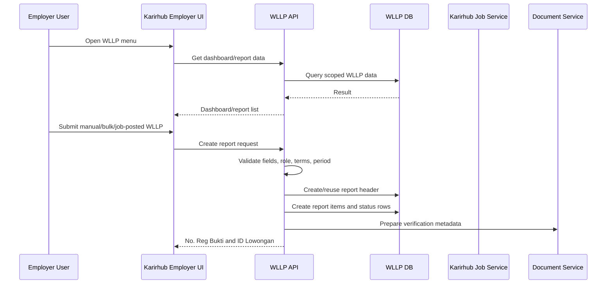
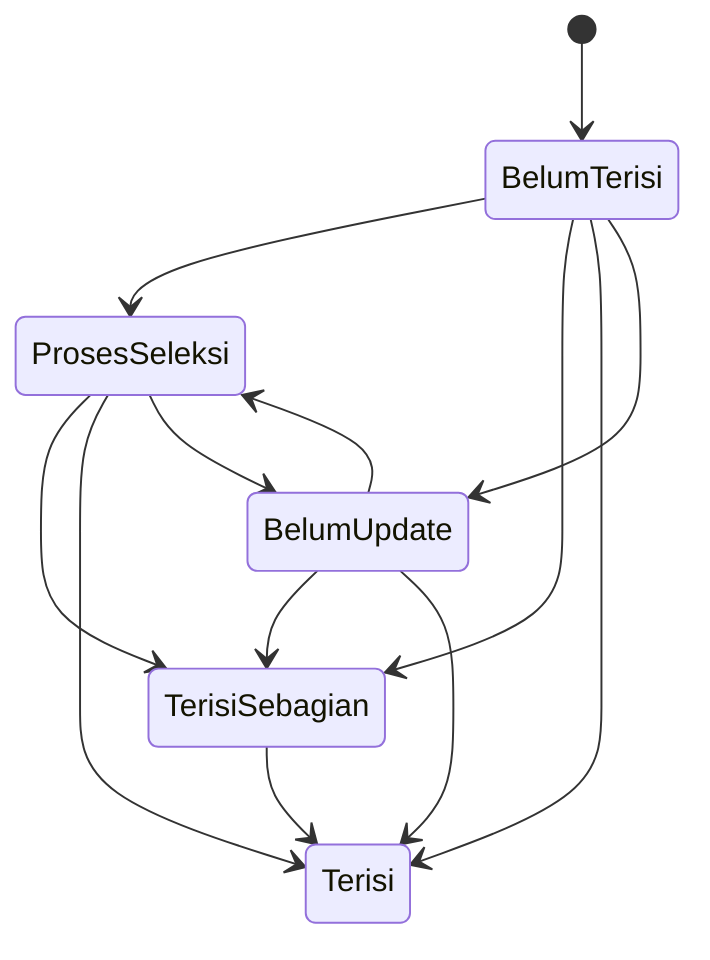
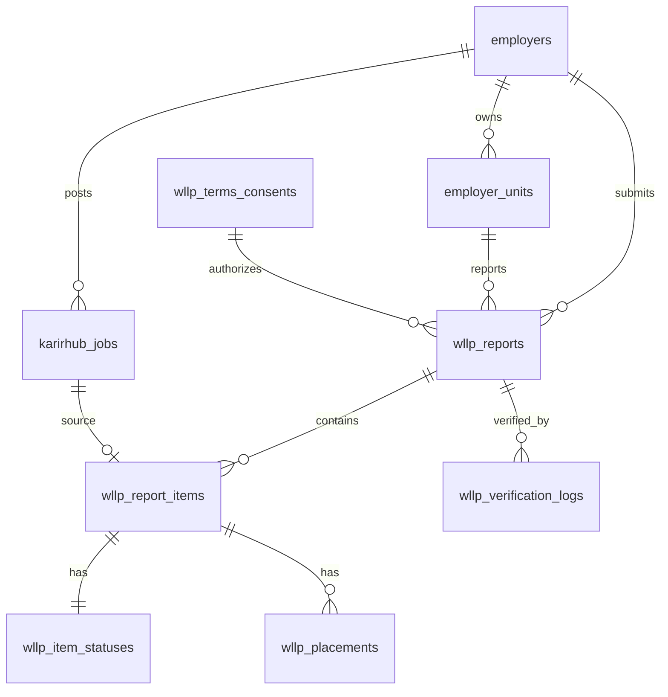

# Functional Specification Document (FSD)
# Karirhub Employer - Wajib Lapor Lowongan Pekerjaan (WLLP)

Version: 1.0  
Related BRD: `BRD_Karirhub_Employer_Prototype_WLLP.md`  
Prepared for: Production implementation engineering  
Source reference: Current `Karirhub Employer Prototype` module in PasAdmin  
Document date: 2026-05-26

---

## 1. Document Purpose

Dokumen ini menjabarkan spesifikasi fungsional dan teknis untuk implementasi production modul Karirhub Employer WLLP. FSD ini dibuat berdasarkan BRD dan prototype yang sudah berjalan, dengan fokus pada detail yang dibutuhkan developer untuk membangun fitur production:

- Modul dan screen behavior.
- Alur data end-to-end.
- Struktur database.
- API contract.
- Validasi input.
- State transition.
- Error handling.
- Security, audit, dan integration points.
- Acceptance scenario untuk QA.

---

## 2. System Context

### 2.1 Target System

Modul WLLP akan menjadi bagian dari Karirhub Employer/SIAPkerja ecosystem. User employer mengakses fitur melalui dashboard pemberi kerja, sedangkan admin Kemnaker mengakses fitur monitoring dan analitik melalui role admin.

### 2.2 External Systems

| System | Usage |
|---|---|
| SIAPkerja SSO/Auth | Authentication, user profile, role, session |
| Karirhub Employer | Job posting source, employer console |
| Employer Master Data | Employer profile, unit/branch, authorization scope |
| Region Master Data | Province/city/district/village validation |
| KBJI Master Data | Job classification validation |
| Industry Master Data | Sector/industry validation |
| Document Verification Service | QR/verification URL for Bukti Lapor |
| Notification Service | Reminder, status update request, compliance alert |
| Audit Log Service | Regulatory and legal traceability |

---

## 3. Functional Module List

| Module Code | Module | User Role |
|---|---|---|
| WLLP-DASH-E | Dashboard WLLP Employer | Employer |
| WLLP-PEL | Pelaporan Lowongan Manual | Employer |
| WLLP-BULK | Bulk Import Pelaporan | Employer |
| WLLP-JOB | Job Posted Karirhub to WLLP | Employer |
| WLLP-PROOF | Bukti Lapor and PDF | Employer, Admin |
| WLLP-REG | No. Reg Bukti Search | Employer, Admin |
| WLLP-STAT | Status Keterisian | Employer |
| WLLP-PLACE | Data Pegawai Ditempatkan | Employer |
| WLLP-COMP | Monitoring Kepatuhan | Employer, Admin |
| WLLP-DASH-A | Dashboard WLLP Admin | Admin |
| WLLP-VERIFY | Verification Workflow | Verifikator/Admin |
| WLLP-AUDIT | Audit and Consent | Admin/Auditor |

---

## 4. Roles and Access Rules

| Role | Access |
|---|---|
| Employer User | View and manage WLLP data for assigned employer/unit only |
| Employer Admin | Manage all WLLP data for employer and employer units |
| Kemnaker Admin | View cross-employer dashboard and detail based on jurisdiction |
| Verifikator | Verify, reject, or request update for WLLP reports/items |
| Auditor | Read-only access to reports, consent, and audit trail |

Access control must be enforced server-side on every API. Frontend role hiding is not sufficient.

---

## 5. High-Level Data Flow



---

## 6. Navigation and Screen Specification

### 6.1 Main Menu

Menu Karirhub Employer shall include:

1. Dashboard WLLP
2. Job Posted Karirhub
3. Pelaporan Lowongan
4. Bukti Lapor
5. Status Keterisian
6. Monitoring Kepatuhan
7. Dashboard WLLP Admin (admin only)

### 6.2 Shared UI Behavior

- Active menu must follow current route.
- Employer-scoped menus must not expose data from other employers.
- Admin menu must be hidden unless user has admin permission.
- All form submit buttons must show loading state during request.
- All create/update operations must show success or error toast/alert.

---

## 7. Screen Functional Specification

### 7.1 Dashboard WLLP Employer

#### Purpose

Provide employer summary of WLLP reporting, status keterisian, compliance, and recent activity.

#### Data Displayed

| Component | Data |
|---|---|
| KPI Total Lowongan Dilaporkan | Count of report items for employer |
| KPI Lowongan Aktif | Items not filled and still valid |
| KPI Sudah Terisi | Items with status `Terisi` |
| KPI Perlu Update | Items/report requiring update |
| Compliance by Unit | Unit-level compliance percentage |
| Recent Activity | Last report creations/status updates |

#### Actions

- Navigate to Pelaporan Lowongan.
- Navigate to Bukti Lapor.
- Navigate to Job Posted Karirhub.
- Navigate to Status Keterisian.

#### Empty State

If employer has no report, show CTA to create WLLP report.

---

### 7.2 Pelaporan Lowongan Manual

#### Purpose

Allow employer to submit one WLLP report with one or many lowongan.

#### Screen Flow

1. Landing choice:
   - Bulk import.
   - Manual form.
2. Manual wizard:
   - Select unit.
   - Select period type.
   - Select anchor date.
   - Input jumlah lowongan.
3. Render lowongan tabs.
4. Validate all lowongan.
5. Show terms modal.
6. Submit.
7. Show success summary.

#### Form Fields

##### Header Fields

| Field | Type | Required | Source/Rule |
|---|---|---|---|
| Unit Perusahaan/Usaha | Dropdown | Yes | Employer unit API |
| Periode Pelaporan | Dropdown | Yes | `weekly`, `monthly` |
| Tanggal Anchor Periode | Date | Yes | Valid date |
| Jumlah ID Lowongan | Number | Yes | 1-50 |
| Catatan | Textarea | No | Max length configured |

##### Lowongan Item Fields

| Field | Type | Required | Rule |
|---|---|---|---|
| Jabatan | Text | Yes | Max 200 chars |
| Jumlah Kebutuhan | Number | Yes | Integer > 0 |
| Jenis Kelamin | Dropdown | Yes | Semua/Laki-laki/Perempuan |
| Usia Minimum | Number | Yes | >= 15 |
| Usia Maksimum | Number | Yes | >= usia minimum |
| Pendidikan Minimal | Dropdown/master | Yes | Education master |
| Deskripsi Pekerjaan | Textarea | Yes | Min configured length |
| Keterampilan Utama | Textarea | Yes | Text or tag list |
| Pengalaman Minimal | Number | Yes | >= 0 |
| Rentang Gaji | Text or numeric range | Yes | Production should use numeric min/max |
| Kode KBJI | Lookup | Yes | Must exist in KBJI master |
| Provinsi | Lookup | Yes | Region master |
| Kota/Kabupaten | Lookup | Yes | Region master |
| Kecamatan | Lookup | Yes | Region master |
| Kelurahan | Lookup | Yes | Region master |
| Bidang Pekerjaan | Lookup | Yes | Job field master |
| Industri/Sektor | Lookup | Yes | Industry master |
| Status Pernikahan | Dropdown | Yes | Bebas/Lajang/Menikah |
| Tipe Kerja | Dropdown | Yes | Full Time/Part Time/Contract/Internship |
| Masa Berlaku Mulai | Date | Yes | <= masa berlaku sampai |
| Masa Berlaku Sampai | Date | Yes | >= masa berlaku mulai |
| Alamat URL Postingan Loker | URL | Yes | Valid URL |

#### Submit Behavior

- API validates role, unit ownership, fields, period, duplicate, and terms consent.
- API generates or reuses report header based on configured policy.
- API creates one `wllp_report_items` record per lowongan.
- API creates default status `Belum Terisi` for each item.

---

### 7.3 Syarat dan Ketentuan Modal

#### Trigger

Shown when user clicks submit on manual form, bulk commit, or job posted add-to-WLLP.

#### Behavior

- Modal displays latest active terms version.
- Checkbox statement is required.
- Submit is disabled until checkbox checked.
- On confirmation, frontend sends `terms_version` and `terms_agreed=true`.
- Backend creates consent record.

#### Error Conditions

| Condition | Error |
|---|---|
| Terms not agreed | `TERMS_REQUIRED` |
| Terms version inactive | `TERMS_VERSION_INVALID` |
| Consent save failure | `TERMS_CONSENT_SAVE_FAILED` |

---

### 7.4 Bulk Import Pelaporan

#### Purpose

Allow employer to report many lowongan in one upload.

#### Flow

1. User downloads template.
2. User fills template.
3. User uploads file.
4. System validates server-side.
5. System returns validation result.
6. User reviews valid/invalid rows.
7. User agrees to terms.
8. User commits import.
9. System creates batch, report headers, items, statuses.

#### Template Versioning

Each template must contain:

- Template version.
- Generated timestamp.
- Field headers.
- Optional hidden reference sheets for dropdown values.

#### Backend Processing

Bulk import must run with:

- Upload batch ID.
- Row-level validation.
- Idempotency protection.
- Error report download.
- Transaction strategy:
  - Option A: all-or-nothing.
  - Option B: commit valid rows and reject invalid rows.

Recommendation for V1: commit valid rows only after user confirms validation result.

---

### 7.5 Job Posted Karirhub

#### Purpose

Allow employer to add existing Karirhub posted jobs into WLLP reporting.

#### List Screen

Display job cards with:

- Job title.
- Location.
- Status.
- Posting date.
- Applicant metrics.
- WLLP insertion status.
- Button `Tambahkan ke dalam WLLP` or disabled `Berhasil ditambahkan ke WLLP`.

#### Detail Screen

Display:

- Job title, status, location.
- Quota/headcount.
- Candidate funnel tabs.
- Job detail fields.
- WLLP action button.

#### Add to WLLP Flow

1. User clicks button.
2. Modal asks period type and anchor date.
3. Terms modal appears.
4. API validates job ID and employer scope.
5. API checks if job already linked to WLLP.
6. API finds existing report header:
   - Same employer.
   - Same period type.
   - Anchor date between existing period start and end.
7. If found, reuse No. Reg Bukti.
8. If not found, generate new No. Reg Bukti.
9. Create new report item linked to Karirhub job ID.
10. Create status row.
11. Return success.

#### Deduplication Rule

Production must deduplicate using `karirhub_job_id`, not title text.

---

### 7.6 Bukti Lapor

#### Purpose

Show proof of WLLP report grouped by No. Reg Bukti and allow PDF download.

#### List Columns

| Column | Description |
|---|---|
| No. Reg Bukti | Report registration number |
| Periode | Weekly/monthly period range |
| Employer | Employer name |
| Unit | Unit name |
| Total ID Lowongan | Count of report items |
| Jumlah Kebutuhan | Sum of needed headcount |
| Jumlah Penempatan | Count/sum of placements |
| Status Verifikasi | Report status |
| Tanggal Lapor | Created date |
| Aksi | Detail, print, download PDF |

#### Detail View

Shows:

- Report header.
- All ID Lowongan under report.
- Status per lowongan.
- Placement summary.
- Verification history.

#### PDF Requirements

PDF must include:

- Kemnaker logo/header.
- Official address.
- No. Reg Bukti.
- Employer and unit info.
- Period.
- Lowongan table.
- Jumlah Kebutuhan and Jumlah Penempatan.
- Verification QR code/URL.
- Digital signature or official validation marker if required.
- Footer with generated timestamp.

---

### 7.7 Status Keterisian

#### Purpose

Allow employer to update hiring/fill status for each reported lowongan.

#### Status Values

| Status | Description |
|---|---|
| Belum Terisi | No placement yet |
| Proses Seleksi | Candidate selection ongoing |
| Terisi Sebagian | Some placements exist but less than needed |
| Terisi | Placements fulfill needed headcount |
| Belum Update | Employer has not updated status beyond defined SLA |

#### Transition Rules



#### Update Behavior

- Every status update must be persisted.
- Every update must create status history.
- `Terisi` and `Terisi Sebagian` require placement data.
- Filled count is calculated from active placement rows.

---

### 7.8 Data Pegawai Yang Ditempatkan

#### Purpose

Capture worker placement data for a reported lowongan.

#### Fields

| Field | Type | Required |
|---|---|---|
| NIK | Text | Yes |
| Nama Lengkap | Text | Yes |
| Pendidikan | Dropdown/master | Yes |
| Jenis Kelamin | Dropdown | Yes |
| Tempat Lahir | Text | Yes |
| Tanggal Lahir | Date | Yes |
| Alamat | Textarea | Yes |
| Status Disabilitas | Dropdown | Yes |
| TMT / Tanggal Mulai Bekerja | Date | Yes |
| Email | Email | Yes |
| Nomor HP | Text | Yes |

#### Rules

- One lowongan can have multiple placement records.
- Placement count cannot exceed `jumlah_kebutuhan` unless override permission exists.
- Duplicate NIK in same lowongan is rejected.
- NIK validation and masking depend on role.

---

### 7.9 Dashboard WLLP Admin

#### Purpose

Provide admin analytics across employers.

#### Filters

- Period type.
- Period date range.
- Employer.
- Unit.
- Province/city.
- Status keterisian.
- Verification status.

#### Visualizations

- Trend pelaporan by period.
- Funnel lowongan: dilaporkan, aktif, proses seleksi, terisi, perlu update.
- Geo distribution.
- Compliance ranking by employer/unit.
- Top lowongan needing update.

#### Drill-Down

Every metric group must link to filtered detail list.

---

### 7.10 Monitoring Kepatuhan

#### Purpose

Monitor employer/unit compliance with WLLP update requirements.

#### Compliance Calculation

Inputs:

- Total reported lowongan.
- Count of lowongan with timely update.
- Count of lowongan overdue.
- Count of reports requiring correction.

Suggested statuses:

- Patuh.
- Perlu Perhatian.
- Tidak Patuh.

Rules must be configurable in admin settings.

---

## 8. Data Model Specification

### 8.1 Entity Relationship



### 8.2 Table Details

#### `wllp_reports`

| Column | Type | Constraint |
|---|---|---|
| `id` | bigint | PK |
| `no_reg_bukti` | varchar(60) | unique, indexed |
| `employer_id` | bigint | FK |
| `unit_id` | bigint | FK nullable |
| `period_type` | enum | weekly/monthly |
| `period_anchor` | date | not null |
| `period_start` | date | not null |
| `period_end` | date | not null |
| `verification_status` | enum | submitted/verified/needs_update/rejected |
| `terms_consent_id` | bigint | FK |
| `created_by` | bigint | FK user |
| `created_at` | timestamp | not null |
| `updated_at` | timestamp | not null |

Indexes:

- Unique `no_reg_bukti`.
- Composite `employer_id, period_type, period_start, period_end`.
- Composite `verification_status, created_at`.

#### `wllp_report_items`

| Column | Type | Constraint |
|---|---|---|
| `id` | bigint | PK |
| `report_id` | bigint | FK |
| `id_lowongan` | varchar(30) | unique |
| `karirhub_job_id` | bigint | nullable FK |
| `title` | varchar(200) | not null |
| `headcount_needed` | int | > 0 |
| `gender_requirement` | varchar(30) | not null |
| `age_min` | int | not null |
| `age_max` | int | not null |
| `education_min_id` | bigint | FK/master |
| `job_description` | text | not null |
| `skills` | text/json | not null |
| `experience_min_years` | int | >= 0 |
| `salary_min` | decimal | nullable |
| `salary_max` | decimal | nullable |
| `kbji_code` | varchar(50) | FK/master |
| `province_id` | bigint | FK |
| `city_id` | bigint | FK |
| `district_id` | bigint | FK |
| `village_id` | bigint | FK |
| `job_field_id` | bigint | FK/master |
| `industry_id` | bigint | FK/master |
| `marital_status_requirement` | varchar(40) | nullable |
| `work_type` | enum | not null |
| `valid_from` | date | not null |
| `valid_until` | date | not null |
| `posting_url` | varchar(500) | not null |
| `verification_status` | enum | default submitted |
| `created_at` | timestamp | not null |
| `updated_at` | timestamp | not null |

Indexes:

- `report_id`.
- `karirhub_job_id`.
- `id_lowongan`.
- `province_id, city_id`.
- `verification_status`.

#### `wllp_item_statuses`

| Column | Type | Constraint |
|---|---|---|
| `id` | bigint | PK |
| `report_item_id` | bigint | unique FK |
| `status` | enum | not null |
| `filled_count` | int | default 0 |
| `last_updated_by` | bigint | FK user |
| `last_updated_at` | timestamp | not null |

#### `wllp_status_histories`

| Column | Type | Constraint |
|---|---|---|
| `id` | bigint | PK |
| `report_item_id` | bigint | FK |
| `old_status` | enum | nullable |
| `new_status` | enum | not null |
| `note` | text | nullable |
| `changed_by` | bigint | FK user |
| `changed_at` | timestamp | not null |

#### `wllp_placements`

| Column | Type | Constraint |
|---|---|---|
| `id` | bigint | PK |
| `report_item_id` | bigint | FK |
| `nik_encrypted` | text | not null |
| `nik_hash` | varchar(128) | indexed |
| `full_name` | varchar(180) | not null |
| `education_id` | bigint | FK/master |
| `gender` | enum | not null |
| `birth_place` | varchar(120) | not null |
| `birth_date` | date | not null |
| `address` | text | not null |
| `disability_status` | boolean | not null |
| `start_date` | date | not null |
| `email` | varchar(180) | not null |
| `phone` | varchar(40) | not null |
| `created_by` | bigint | FK user |
| `created_at` | timestamp | not null |
| `updated_at` | timestamp | not null |

Unique:

- `report_item_id, nik_hash`.

#### `wllp_terms_consents`

| Column | Type | Constraint |
|---|---|---|
| `id` | bigint | PK |
| `terms_version` | varchar(40) | not null |
| `employer_id` | bigint | FK |
| `user_id` | bigint | FK |
| `source` | enum | manual_form/bulk_import/job_posted |
| `consented_at` | timestamp | not null |
| `ip_address` | varchar(60) | nullable |
| `user_agent` | varchar(500) | nullable |

---

## 9. ID Generation Specification

### 9.1 No. Reg Bukti

Format:

```text
WLLP-57YYMM-XXXXXXXX
```

Example:

```text
WLLP-572605-00001278
```

Rules:

- `WLLP-57` is fixed prefix.
- `YYMM` is derived from period anchor.
- `XXXXXXXX` is 8 digit sequence.
- Sequence must be generated atomically to avoid race conditions.

Implementation recommendation:

- Use dedicated sequence table keyed by `prefix`.
- Generate inside database transaction with row lock.

### 9.2 ID Lowongan

Format:

```text
LK-XXXXXX
```

Rules:

- 6 digit sequence.
- Unique globally or unique within report based on policy.
- Recommendation: unique globally for easier search.

---

## 10. API Contract Specification

### 10.1 Create Manual WLLP Report

Endpoint:

```http
POST /api/wllp/reports
```

Request:

```json
{
  "unit_id": 1001,
  "period_type": "weekly",
  "period_anchor": "2026-06-03",
  "notes": "Pelaporan minggu pertama Juni",
  "terms": {
    "agreed": true,
    "version": "WLLP-TC-2026-01"
  },
  "items": [
    {
      "title": "Staff Operasional",
      "headcount_needed": 3,
      "gender_requirement": "Semua",
      "age_min": 21,
      "age_max": 35,
      "education_min_id": 5,
      "job_description": "Melakukan operasional harian.",
      "skills": "Microsoft Office, komunikasi",
      "experience_min_years": 1,
      "salary_min": 4000000,
      "salary_max": 6000000,
      "kbji_code": "4110",
      "province_id": 31,
      "city_id": 3171,
      "district_id": 317101,
      "village_id": 31710101,
      "job_field_id": 10,
      "industry_id": 20,
      "marital_status_requirement": "Bebas",
      "work_type": "Full Time",
      "valid_from": "2026-06-01",
      "valid_until": "2026-06-30",
      "posting_url": "https://karirhub.kemnaker.go.id/jobs/123"
    }
  ]
}
```

Success response:

```json
{
  "success": true,
  "report": {
    "id": 501,
    "no_reg_bukti": "WLLP-572606-00000001",
    "period_start": "2026-06-01",
    "period_end": "2026-06-07",
    "verification_status": "submitted"
  },
  "items": [
    {
      "id": 9001,
      "id_lowongan": "LK-000001",
      "status": "Belum Terisi"
    }
  ]
}
```

Error response:

```json
{
  "success": false,
  "error_code": "VALIDATION_FAILED",
  "message": "Data belum lengkap.",
  "fields": {
    "items.0.kbji_code": "Kode KBJI tidak valid."
  }
}
```

### 10.2 Validate Bulk Import

```http
POST /api/wllp/reports/bulk/validate
Content-Type: multipart/form-data
```

Response:

```json
{
  "batch_id": "BULK-20260603-0001",
  "template_version": "WLLP-BULK-1.0",
  "total_rows": 100,
  "valid_rows": 92,
  "invalid_rows": 8,
  "errors": [
    {
      "row": 12,
      "field": "kbji_code",
      "message": "Kode KBJI tidak ditemukan."
    }
  ]
}
```

### 10.3 Commit Bulk Import

```http
POST /api/wllp/reports/bulk/commit
```

Request:

```json
{
  "batch_id": "BULK-20260603-0001",
  "terms": {
    "agreed": true,
    "version": "WLLP-TC-2026-01"
  }
}
```

### 10.4 Add Karirhub Job to WLLP

```http
POST /api/karirhub/jobs/{jobId}/add-to-wllp
```

Request:

```json
{
  "period_type": "weekly",
  "period_anchor": "2026-06-03",
  "terms": {
    "agreed": true,
    "version": "WLLP-TC-2026-01"
  }
}
```

Response:

```json
{
  "success": true,
  "reused_report": true,
  "no_reg_bukti": "WLLP-572606-00000001",
  "id_lowongan": "LK-000002",
  "status_label": "Berhasil ditambahkan ke WLLP"
}
```

### 10.5 Update Status Keterisian

```http
PUT /api/wllp/items/{itemId}/status
```

Request:

```json
{
  "status": "Proses Seleksi",
  "note": "Kandidat sedang tahap interview."
}
```

### 10.6 Add Placement

```http
POST /api/wllp/items/{itemId}/placements
```

Request:

```json
{
  "nik": "3171xxxxxxxxxxxx",
  "full_name": "Budi Santoso",
  "education_id": 5,
  "gender": "Laki-laki",
  "birth_place": "Jakarta",
  "birth_date": "1998-01-20",
  "address": "Jakarta Selatan",
  "disability_status": false,
  "start_date": "2026-06-10",
  "email": "budi@example.com",
  "phone": "081234567890"
}
```

---

## 11. Error Code Specification

| Error Code | Meaning | HTTP |
|---|---|---|
| `UNAUTHORIZED` | User not authenticated | 401 |
| `FORBIDDEN` | User has no access to employer/unit/data | 403 |
| `VALIDATION_FAILED` | Request field validation failed | 422 |
| `TERMS_REQUIRED` | Terms not agreed | 422 |
| `DUPLICATE_JOB_WLLP` | Job already added to WLLP | 409 |
| `REPORT_NOT_FOUND` | Report not found or out of scope | 404 |
| `ITEM_NOT_FOUND` | Report item not found or out of scope | 404 |
| `PERIOD_INVALID` | Period type/date invalid | 422 |
| `BULK_TEMPLATE_INVALID` | Uploaded file template invalid | 422 |
| `PLACEMENT_LIMIT_EXCEEDED` | Placement count exceeds headcount needed | 409 |
| `PDF_GENERATION_FAILED` | Failed generating PDF | 500 |

---

## 12. Validation and Business Logic Detail

### 12.1 Period Derivation

```text
weekly:
  period_start = Monday of anchor week
  period_end = Sunday of anchor week

monthly:
  period_start = first day of anchor month
  period_end = last day of anchor month
```

### 12.2 Header Reuse Logic

```sql
SELECT id, no_reg_bukti
FROM wllp_reports
WHERE employer_id = :employer_id
  AND period_type = :period_type
  AND :period_anchor BETWEEN period_start AND period_end
ORDER BY created_at DESC
LIMIT 1;
```

If found, reuse. If not found, create new report.

### 12.3 Status Calculation

```text
filled_count = count(active placement records)

if filled_count = 0:
  status remains selected status or Belum Terisi
if filled_count > 0 and filled_count < headcount_needed:
  status = Terisi Sebagian
if filled_count >= headcount_needed:
  status = Terisi
```

---

## 13. Security and Privacy

### 13.1 Security Requirements

- All endpoints must require authenticated session/token.
- All write endpoints must verify CSRF token for web session.
- All queries must be scoped by employer/unit/admin jurisdiction.
- File uploads must enforce size, extension, MIME, and content validation.
- PDF and export downloads must be authorized.
- Rate limit create and bulk endpoints.

### 13.2 Personal Data Protection

- NIK must be encrypted at rest.
- NIK hash may be stored for deduplication.
- NIK should be masked in UI unless user role requires full view.
- Placement export must be restricted and audited.
- Consent and audit logs must be immutable or append-only.

---

## 14. Audit Logging

System must log:

- Report created.
- Report updated.
- Report verified/rejected/needs update.
- Item created/updated.
- Status changed.
- Placement created/updated/deleted.
- PDF downloaded.
- Bulk import validated/committed.
- Export downloaded.
- Terms consent accepted.

Audit log fields:

- Actor user ID.
- Actor role.
- Employer ID.
- Entity type and ID.
- Action.
- Before/after JSON where applicable.
- Timestamp.
- IP address.
- User agent.

---

## 15. PDF Generation Specification

### 15.1 File Naming

```text
bukti-lapor-{no_reg_bukti}.pdf
```

### 15.2 PDF Content

1. Header:
   - Kemnaker logo.
   - Ministry name.
   - Official address.
2. Title:
   - `BUKTI LAPOR LOWONGAN PEKERJAAN (WLLP)`.
3. Report metadata:
   - No. Reg Bukti.
   - Employer.
   - Unit.
   - Period.
   - Verification status.
   - Generated timestamp.
4. Lowongan table:
   - ID Lowongan.
   - Jabatan.
   - Jumlah Kebutuhan.
   - Jumlah Penempatan.
   - Lokasi.
   - Status.
5. Verification:
   - QR code.
   - Verification URL.
   - Digital signature marker if available.
6. Footer:
   - System source.
   - Disclaimer/legal statement based on legal decision.

---

## 16. Bulk Import File Specification

### 16.1 Pelaporan Template Required Columns

- Unit ID.
- Periode Tipe.
- Tanggal Anchor.
- Jabatan.
- Jumlah Kebutuhan.
- Jenis Kelamin.
- Usia Minimum.
- Usia Maksimum.
- Pendidikan Minimal.
- Deskripsi Pekerjaan.
- Keterampilan Utama.
- Pengalaman Minimal Tahun.
- Gaji Minimum.
- Gaji Maksimum.
- Kode KBJI.
- Provinsi.
- Kota.
- Kecamatan.
- Kelurahan.
- Bidang Pekerjaan.
- Industri/Sektor.
- Status Pernikahan.
- Tipe Kerja.
- Masa Berlaku Mulai.
- Masa Berlaku Sampai.
- URL Postingan Loker.
- Catatan.

### 16.2 Placement Template Required Columns

- No. Reg Bukti.
- ID Lowongan.
- NIK.
- Nama Lengkap.
- Pendidikan.
- Jenis Kelamin.
- Tempat Lahir.
- Tanggal Lahir.
- Alamat.
- Status Disabilitas.
- TMT.
- Email.
- Nomor HP.

---

## 17. Testing Specification

### 17.1 Unit Tests

- Period derivation weekly/monthly.
- No. Reg generation.
- ID Lowongan generation.
- Field validation.
- Header reuse query.
- Status calculation.
- Placement limit validation.

### 17.2 Integration Tests

- Manual report create with 1 lowongan.
- Manual report create with many lowongan.
- Job Posted to WLLP creates new report.
- Job Posted to WLLP reuses report by period range.
- Duplicate Job Posted insertion rejected.
- Bulk validate and commit.
- Status update with placement.
- PDF download.
- Admin dashboard filters.

### 17.3 Security Tests

- Employer cannot access another employer data.
- Non-admin cannot access admin dashboard API.
- Unauthorized PDF download rejected.
- Upload malicious file rejected.
- NIK masking enforced by role.

### 17.4 Regression Tests from Prototype Behavior

- One No. Reg Bukti can represent many ID Lowongan.
- `WLLP-57YYMM-XXXXXXXX` format maintained.
- `Berhasil ditambahkan ke WLLP` appears after add-to-WLLP.
- Anchor inside same weekly/monthly range reuses No. Reg Bukti.
- Terms modal required before submit.

---

## 18. Deployment and Migration Notes

### 18.1 Migration from Prototype

Prototype tables must not be migrated directly to production without transformation. They can be used as seed/reference for:

- Field mapping.
- UI behavior.
- Test scenarios.
- Initial dummy data.

### 18.2 Required Production Migration Order

1. Master/reference tables.
2. Employer and unit integration.
3. WLLP reports.
4. WLLP report items.
5. Status and histories.
6. Placements.
7. Terms and consent.
8. Audit logs.

### 18.3 Backward Compatibility

If existing WLLP records already exist in production:

- Build mapping for old registration format to new format.
- Preserve historical proof numbers.
- Do not regenerate official numbers without legal approval.

---

## 19. Open Technical Decisions

1. Whether manual form should always create new No. Reg Bukti or reuse existing period header like Job Posted flow.
2. Whether one WLLP report can span multiple units under one employer.
3. Whether `Terisi Sebagian` is official status or derived UI label only.
4. Whether Bukti Lapor PDF requires digital signature for V1.
5. Whether bulk import commits valid rows only or requires all-or-nothing.
6. Whether closed Karirhub jobs can be added to WLLP.
7. Whether placement worker identity requires external verification in V1.

---

## 20. Appendix - Prototype to Production Mapping

| Prototype File | Production Module |
|---|---|
| `karirhub_employer_prototype_dashboard_wllp.php` | WLLP-DASH-E |
| `karirhub_employer_prototype_dashboard_wllp_admin.php` | WLLP-DASH-A |
| `karirhub_employer_prototype_job_posted_karirhub.php` | WLLP-JOB |
| `karirhub_employer_prototype_job_posted_karirhub_detail.php` | WLLP-JOB Detail |
| `karirhub_employer_prototype_pelaporan_lowongan.php` | WLLP-PEL, WLLP-BULK |
| `karirhub_employer_prototype_bukti_lapor.php` | WLLP-PROOF |
| `karirhub_employer_prototype_status_keterisian.php` | WLLP-STAT, WLLP-PLACE |
| `karirhub_employer_prototype_no_reg_bukti.php` | WLLP-REG |
| `karirhub_employer_prototype_monitoring_kepatuhan.php` | WLLP-COMP |
| `karirhub_employer_prototype_storage.php` | Data model, ID generation, seed reference |
| `karirhub_employer_prototype_data.php` | Master/reference mock data |
| `karirhub_employer_prototype_ui.php` | Shared UI shell reference |

---

## 21. Implementation Readiness Checklist

- BRD approved.
- Terms and legal wording approved.
- Role matrix approved.
- Master data APIs available.
- Karirhub job API available.
- WLLP database schema approved.
- No. Reg Bukti format approved.
- PDF legal requirement approved.
- Bulk import transaction policy approved.
- Security and privacy review completed.
- QA test cases derived from this FSD.

---

## 22. Conclusion

FSD ini mendefinisikan perilaku production untuk Karirhub Employer WLLP berdasarkan prototype yang sudah dibangun. Fokus utama implementasi production adalah mengganti simulasi dengan backend service yang konsisten, memperkuat validasi dan authorization, memastikan audit/consent tercatat, serta menyatukan data Karirhub Job, WLLP Report, Bukti Lapor, Status Keterisian, dan Penempatan dalam satu source of truth.
